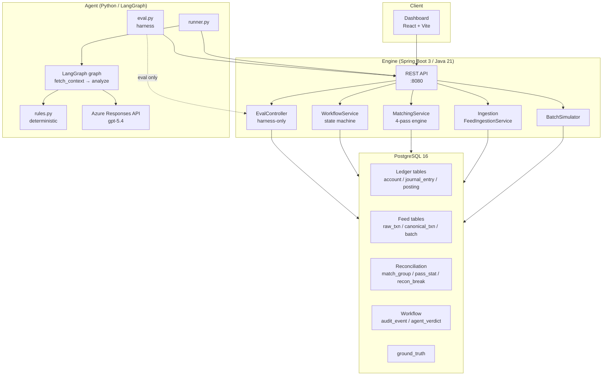
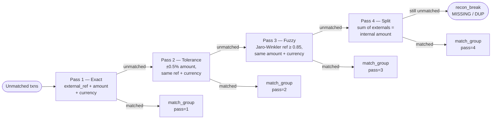
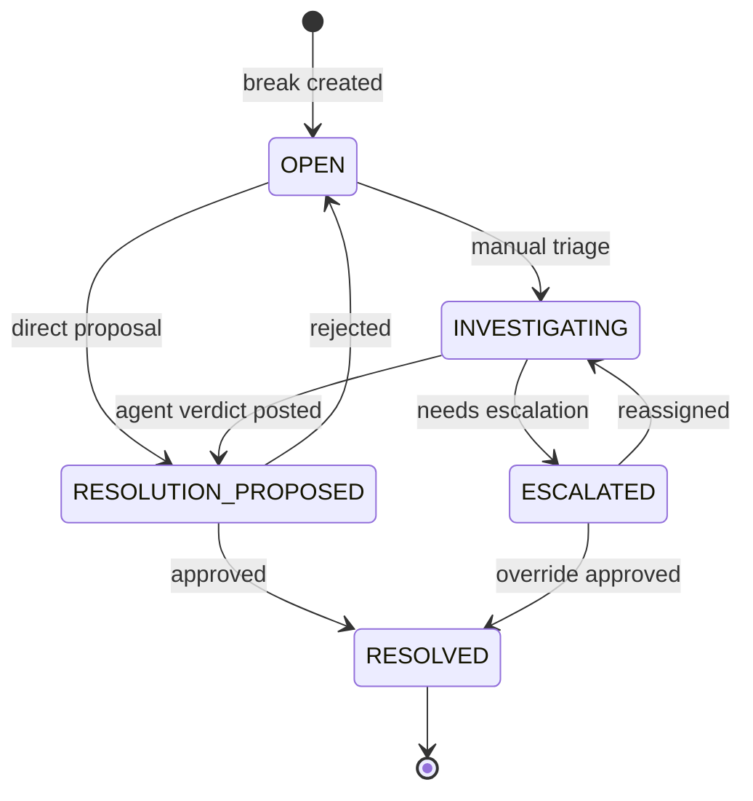

# ReconAI — Architecture

## Component Overview



## Matching Pipeline (4-pass)



## Break Workflow State Machine



## Agent LangGraph Flow

```mermaid
graph LR
    START([__start__])
    FC[fetch_context\nGET /api/breaks/{id}/context]
    AN[analyze\nrules or LLM]
    END([__end__])

    START --> FC --> AN --> END
```

### Rules mode decision tree

```
DUP_EXTERNAL detected type OR dup_scan non-empty
  → DUP_EXTERNAL / REVERSE_DUPLICATE (conf 0.92)

Near-miss exists:
  refs differ + nm.status = MATCHED
    → DUP_EXTERNAL / REVERSE_DUPLICATE (conf 0.85)
  same ref + diff_pct > 5%
    → AMT_FAT_FINGER / MANUAL_REVIEW (conf 0.72)
  same ref + diff_pct ≤ 0.5% + same date
    → AMT_FX_ROUNDING / APPROVE_TOLERANCE (conf 0.84)
  same ref + diff_pct ≈ 0 + date_diff ≤ 2
    → DATE_TIMING / WAIT_SELF_CLEAR (conf 0.80)
  refs differ + nm.status ≠ MATCHED
    → REF_CORRUPTION / REPROCESS_WITH_CORRECT_REF (conf 0.76)

Detected type fallback:
  MISSING_EXTERNAL → CREATE_MISSING_POSTING
  MISSING_INTERNAL → CREATE_MISSING_POSTING

Default:
  → MANUAL_REVIEW (conf 0.40)
```

## Database Schema (key tables)

```
batch                canonical_txn          match_group
├── id               ├── id                 ├── id
├── status           ├── batch_id           ├── batch_id
├── n                ├── side               ├── pass_number
└── seed             ├── external_ref       └── created_at
                     ├── amount
                     ├── currency           recon_break
                     └── value_date         ├── id
                                            ├── batch_id
ground_truth                                ├── detected_type
├── batch_id                                ├── status (state machine)
├── external_ref                            └── created_at
└── injected_code
                     agent_verdict          audit_event (immutable)
                     ├── break_id           ├── break_id
                     ├── root_cause_code    ├── actor
                     ├── confidence         ├── action
                     └── explanation        └── payload (JSONB)
```
